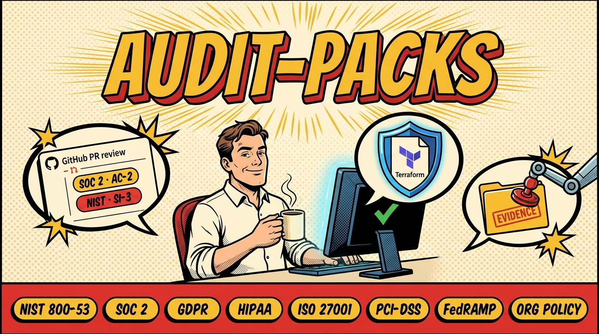

# audit-packs

[](LICENSE)
[](pyproject.toml)

<p align="center">
  
</p>

> An evidence-first Compliance Intelligence Engine that transforms security scanner findings into standardized, evidence-backed compliance artifacts — inline PR comments, OSCAL, SARIF, and coverage reports.

Detection is delegated entirely to best-in-class OSS engines (Checkov, Semgrep, CodeQL, Trivy, and more). The core engine is scanner-agnostic: any tool that emits SARIF can feed it. What audit-packs adds is the **normalization → compliance mapping → evidence generation → output** layer: reviewers see not just "S3 bucket unencrypted" but:

> **NIST 800-53 / SC-13 — Cryptographic Protection**
> Severity: `high` | Engine: `checkov` (`CKV_AWS_19`)
> Evidence: `server_side_encryption_configuration is not set`

---

## Supported Scanners

| Scanner | Status |
|---------|--------|
| Checkov | Supported |
| Semgrep | Supported |
| CodeQL  | Supported (SARIF dir input) |
| Trivy   | Supported |
| tfsec   | Supported |
| gitleaks | Supported |

---

## Why this exists

Checkov and Semgrep are excellent at finding IaC misconfigurations. They are not designed to answer the question auditors and GRC teams actually ask: *which compliance controls are affected, and where is the evidence?* audit-packs bridges that gap by wrapping detection output in a compliance control mapping layer, confidence scoring, and audit-grade evidence packaging — without replacing or re-implementing any detection engine.

---

## Quick start

Refer to the complete [Setup & Integration Guide](docs/SETUP.md) for detailed CLI, VS Code extension, and notification configuration.

```yaml
# .github/workflows/audit.yml
name: Audit Packs

on:
  pull_request:

jobs:
  audit:
    runs-on: ubuntu-latest
    permissions:
      contents: read
      pull-requests: write   # required to post inline review comments

    steps:
      - uses: actions/checkout@v4
        with:
          fetch-depth: 0     # required for diff-only scanning

      - uses: prakharsingh/audit-packs@v1
        with:
          frameworks: nist-800-53,soc2
          fail-on: high
```

The action posts inline review comments on changed lines only, writes an OSCAL assessment-results JSON, a control coverage matrix, and an aggregate SARIF file, then exits non-zero if any finding meets or exceeds `fail-on`.

---

## Inputs

| Input | Default | Description |
|---|---|---|
| `frameworks` | **required** | Comma- or newline-separated pack IDs to evaluate. See [Framework coverage](#framework-coverage). |
| `fail-on` | `high` | Minimum severity that fails the check. One of `low`, `medium`, `high`, `critical`. |
| `base-ref` | `origin/main` | Base git ref to diff against. Change for non-standard default branch names. |
| `scan-mode` | `both` | `diff` — PR comments + gate only. `full` — posture outputs only. `both` — all paths (recommended). |
| `emit-oscal` | `true` | Write OSCAL assessment-results JSON to `oscal.json`. |
| `emit-coverage` | `true` | Write a control coverage matrix to `coverage.md` / `coverage.html` and append to the job summary. |
| `seo-title` | `Audit Packs Control Coverage Matrix` | HTML `<title>`, Open Graph title, and JSON-LD name for `coverage.html`. |
| `seo-description` | `Compliance control coverage report generated by audit-packs.` | Meta description, Open Graph description, and JSON-LD description for `coverage.html`. |
| `seo-canonical-url` | `""` | Optional canonical URL for `coverage.html` when publishing the report. |
| `emit-sarif` | `true` | Write an aggregate SARIF file to `audit-packs.sarif`. |
| `adjudication-mode` | `off` | LLM adjudication: `off` (disabled), `advisory` (score and log, no filtering), `enforce` (suppress findings below `min-confidence`). |
| `min-confidence` | `0.70` | Composite confidence threshold (0.0–1.0). Findings below this are suppressed in `enforce` mode. |
| `models-config` | `audit-models.yaml` | Repo-relative path to a model routing YAML that maps roles to providers. Falls back to built-in defaults if absent. |
| `detector-model` | `""` | Override the `detector` role's model (sets `DETECTOR_MODEL` env). |
| `verifier-model` | `""` | Override the `verifier` role's model (sets `VERIFIER_MODEL` env). |
| `adversarial-model` | `""` | Override the `adversarial` role's model (sets `ADVERSARIAL_MODEL` env). |
| `judge-model` | `""` | Override the `judge` role's model (sets `JUDGE_MODEL` env). |
| `codeql-sarif` | `""` | Repo-relative path to directory of CodeQL SARIF files. Gracefully skipped if absent. |
| `ast-rules` | `ast-rules` | Path to Tree-sitter AST rule scripts directory (reserved for Phase 2; ignored in Phase 1). |
| `trivy-enabled` | `true` | Enable Trivy filesystem + image scanning. Requires trivy binary ≥ v0.69.2 on the runner. |
| `trivy-image` | `""` | Docker image reference for `trivy image` scan. Skipped when empty. Only used when `trivy-enabled` is `true`. |
| `tfsec-enabled` | `true` | Enable tfsec Terraform security checks. |
| `gitleaks-enabled` | `true` | Enable gitleaks secret detection. |

## Outputs

| Output | Path | Description |
|---|---|---|
| `oscal-path` | `oscal.json` | OSCAL assessment-results document for audit evidence packages. |
| `coverage-md-path` | `coverage.md` | Markdown control coverage matrix. |
| `coverage-html-path` | `coverage.html` | HTML control coverage matrix. |
| `sarif-path` | `audit-packs.sarif` | Aggregate SARIF file for upload to GitHub Code Scanning. |

---

## Outputs in depth

### Inline PR comments

For every finding on a changed line, the action posts a review comment:

> **Compliance control touched: `nist-800-53` / SC-13 — Cryptographic Protection**
>
> - Severity: `high`
> - Engine: `checkov` (`CKV_AWS_19`)
> - Finding: Ensure S3 bucket has encryption enabled
>
> Evidence:
> ```
> server_side_encryption_configuration is not set
> ```

Comments are **diff-filtered**: only findings on lines added or modified in the PR are posted. Findings on unchanged lines are silently dropped.

### OSCAL assessment-results

When `emit-oscal: true`, the action writes an [OSCAL assessment-results](https://pages.nist.gov/OSCAL/) document to `oscal.json`. This is the machine-readable format GRC tools and FedRAMP / NIST 800-53 evidence packages expect.

```yaml
- uses: prakharsingh/audit-packs@v1
  id: audit

- name: Upload OSCAL evidence
  uses: actions/upload-artifact@v4
  with:
    name: oscal-assessment-results
    path: ${{ steps.audit.outputs.oscal-path }}
```

### Control coverage matrix

When `emit-coverage: true`, the action writes `coverage.md` and `coverage.html` and appends the matrix to the Actions job summary. The matrix lists every control in the selected frameworks, whether it is automatically assessable via IaC checks, and its current pass / fail / not-applicable status.

`coverage.html` is a complete SEO-ready document with description, robots, Open Graph, Twitter card, optional canonical URL, and JSON-LD metadata. Set `seo-title`, `seo-description`, and `seo-canonical-url` when publishing the report as a static page.

### Aggregate SARIF and GitHub Code Scanning

When `emit-sarif: true`, findings across all engines are merged into a single SARIF file. Upload it to GitHub Code Scanning for a unified security overview:

```yaml
- uses: prakharsingh/audit-packs@v1

- uses: github/codeql-action/upload-sarif@v3
  with:
    sarif_file: audit-packs.sarif
```

---

## Framework coverage

| Framework | Pack ID | Type | Automated controls |
|---|---|---|---|
| NIST SP 800-53 Rev 5 | `nist-800-53` | Canonical | 20 |
| SOC 2 Type II (AICPA 2017) | `soc2` | Crosswalk → NIST 800-53 | 17 of 39 (22 are governance-only) |
| ISO/IEC 27001:2022 | `iso27001` | Crosswalk → NIST 800-53 | 10 |
| PCI-DSS v4.0 | `pci-dss` | Crosswalk → NIST 800-53 | 8 |
| FedRAMP Moderate | `fedramp` | Crosswalk → NIST 800-53 | 8 |
| HIPAA Security Rule | `hipaa` | Crosswalk → NIST 800-53 | 6 |
| GDPR (technical controls) | `gdpr` | Crosswalk → NIST 800-53 | 5 |
| Org-policy (custom) | `org-policy` | Crosswalk → NIST 800-53 | 6 (configurable) |

NIST 800-53 is the canonical pack. Every other framework is a crosswalk pack: each control maps to one or more NIST controls, which resolve to engine check IDs. Adding a new framework never requires touching detection logic — you add a YAML pack.

### Detailed Control Mapping Matrix

Below is a detailed matrix of supported/automated controls across all frameworks, resolved to their underlying static engine rules (Checkov, Semgrep) and custom Phase 2 detection agents.

<!-- MATRIX_START -->
#### FedRAMP Moderate Baseline (`fedramp`)

**Reference Ruleset / Standard:** [FedRAMP Moderate Baseline](https://www.fedramp.gov/)

| Control ID | Control Title | Automation Status | Mapped Rules / Heuristics |
| --- | --- | --- | --- |
| SC-13 | Cryptographic Protection (FedRAMP Moderate) | ✅ **Automated** | `SC-13` (*checkov*: `CKV_AWS_19`, `CKV_AWS_5`, `CKV_AWS_145`; *semgrep*: [`weak-cipher`](rules/weak-cipher.yaml); *dataflow-agent*: `DFA-001`; *fedramp-agent*: `FEDRAMP-001`) |
| SC-28 | Protection of Information at Rest (FedRAMP Moderate) | ✅ **Automated** | `SC-28` (*checkov*: `CKV_AWS_17`, `CKV_AWS_27`, `CKV_AWS_77`, `CKV_AWS_84`, `CKV_AWS_189`, `CKV_AWS_211`; *dataflow-agent*: `DFA-001`; *gdpr-agent*: `GDPR-001`; *hipaa-agent*: `HIPAA-001`) |
| SC-8 | Transmission Confidentiality (FedRAMP Moderate) | ✅ **Automated** | `SC-8` (*checkov*: `CKV_AWS_2`, `CKV_AWS_86`, `CKV_AWS_68`; *semgrep*: [`no-tls-verify`](rules/no-tls-verify.yaml)) |
| SC-7 | Boundary Protection (FedRAMP Moderate) | ✅ **Automated** | `SC-7` (*checkov*: `CKV_AWS_24`, `CKV_AWS_25`, `CKV_AWS_88`, `CKV_AWS_130`) |
| AC-3 | Access Enforcement (FedRAMP Moderate) | ✅ **Automated** | `AC-3` (*checkov*: `CKV_AWS_53`, `CKV_AWS_54`, `CKV_AWS_55`, `CKV_AWS_56`, `CKV_AWS_62`; *hipaa-agent*: `HIPAA-002`) |
| AC-6 | Least Privilege (FedRAMP Moderate) | ✅ **Automated** | `AC-6` (*checkov*: `CKV_AWS_40`, `CKV_AWS_274`; *semgrep*: [`overpermissive-iam`](rules/overpermissive-iam.yaml)) |
| IA-5 | Authenticator Management (FedRAMP Moderate) | ✅ **Automated** | `IA-5` (*checkov*: `CKV_AWS_6`; *semgrep*: [`hardcoded-credential`](rules/hardcoded-credential.yaml)) |
| AU-2 | Audit Events (FedRAMP Moderate) | ✅ **Automated** | `AU-2` (*checkov*: `CKV_AWS_67`, `CKV_AWS_35`, `CKV_AWS_1`; *soc2-agent*: `SOC2-002`) |


#### EU General Data Protection Regulation (GDPR) (`gdpr`)

**Reference Ruleset / Standard:** [GDPR Articles & Technical Controls](https://gdpr-info.eu/)

| Control ID | Control Title | Automation Status | Mapped Rules / Heuristics |
| --- | --- | --- | --- |
| Art-25 | Data Protection by Design and by Default | ✅ **Automated** | `SC-13` (*checkov*: `CKV_AWS_19`, `CKV_AWS_5`, `CKV_AWS_145`; *semgrep*: [`weak-cipher`](rules/weak-cipher.yaml); *dataflow-agent*: `DFA-001`; *fedramp-agent*: `FEDRAMP-001`), `SC-28` (*checkov*: `CKV_AWS_17`, `CKV_AWS_27`, `CKV_AWS_77`, `CKV_AWS_84`, `CKV_AWS_189`, `CKV_AWS_211`; *dataflow-agent*: `DFA-001`; *gdpr-agent*: `GDPR-001`; *hipaa-agent*: `HIPAA-001`) |
| Art-30 | Records of Processing Activities | ✅ **Automated** | `AU-2` (*checkov*: `CKV_AWS_67`, `CKV_AWS_35`, `CKV_AWS_1`; *soc2-agent*: `SOC2-002`) |
| Art-32-a | Pseudonymisation and Encryption | ✅ **Automated** | `SC-13` (*checkov*: `CKV_AWS_19`, `CKV_AWS_5`, `CKV_AWS_145`; *semgrep*: [`weak-cipher`](rules/weak-cipher.yaml); *dataflow-agent*: `DFA-001`; *fedramp-agent*: `FEDRAMP-001`), `SC-28` (*checkov*: `CKV_AWS_17`, `CKV_AWS_27`, `CKV_AWS_77`, `CKV_AWS_84`, `CKV_AWS_189`, `CKV_AWS_211`; *dataflow-agent*: `DFA-001`; *gdpr-agent*: `GDPR-001`; *hipaa-agent*: `HIPAA-001`) |
| Art-32-b | Confidentiality and Integrity of Processing | ✅ **Automated** | `SC-8` (*checkov*: `CKV_AWS_2`, `CKV_AWS_86`, `CKV_AWS_68`; *semgrep*: [`no-tls-verify`](rules/no-tls-verify.yaml)), `SC-7` (*checkov*: `CKV_AWS_24`, `CKV_AWS_25`, `CKV_AWS_88`, `CKV_AWS_130`) |
| Art-32-d | Regular Testing and Evaluation | ✅ **Automated** | `AU-2` (*checkov*: `CKV_AWS_67`, `CKV_AWS_35`, `CKV_AWS_1`; *soc2-agent*: `SOC2-002`) |


#### HIPAA Security Rule (45 CFR Part 164) (`hipaa`)

**Reference Ruleset / Standard:** [HIPAA Security Rule Regulations](https://www.hhs.gov/hipaa/for-professionals/security/laws-regulations/index.html)

| Control ID | Control Title | Automation Status | Mapped Rules / Heuristics |
| --- | --- | --- | --- |
| §164.312(a)(1) | Access Control Standard | ✅ **Automated** | `AC-3` (*checkov*: `CKV_AWS_53`, `CKV_AWS_54`, `CKV_AWS_55`, `CKV_AWS_56`, `CKV_AWS_62`; *hipaa-agent*: `HIPAA-002`), `AC-6` (*checkov*: `CKV_AWS_40`, `CKV_AWS_274`; *semgrep*: [`overpermissive-iam`](rules/overpermissive-iam.yaml)) |
| §164.312(a)(2)(iv) | Encryption and Decryption | ✅ **Automated** | `SC-13` (*checkov*: `CKV_AWS_19`, `CKV_AWS_5`, `CKV_AWS_145`; *semgrep*: [`weak-cipher`](rules/weak-cipher.yaml); *dataflow-agent*: `DFA-001`; *fedramp-agent*: `FEDRAMP-001`), `SC-28` (*checkov*: `CKV_AWS_17`, `CKV_AWS_27`, `CKV_AWS_77`, `CKV_AWS_84`, `CKV_AWS_189`, `CKV_AWS_211`; *dataflow-agent*: `DFA-001`; *gdpr-agent*: `GDPR-001`; *hipaa-agent*: `HIPAA-001`) |
| §164.312(b) | Audit Controls | ✅ **Automated** | `AU-2` (*checkov*: `CKV_AWS_67`, `CKV_AWS_35`, `CKV_AWS_1`; *soc2-agent*: `SOC2-002`) |
| §164.312(d) | Person or Entity Authentication | ✅ **Automated** | `IA-5` (*checkov*: `CKV_AWS_6`; *semgrep*: [`hardcoded-credential`](rules/hardcoded-credential.yaml)) |
| §164.312(e)(1) | Transmission Security Standard | ✅ **Automated** | `SC-8` (*checkov*: `CKV_AWS_2`, `CKV_AWS_86`, `CKV_AWS_68`; *semgrep*: [`no-tls-verify`](rules/no-tls-verify.yaml)) |
| §164.312(e)(2)(ii) | Encryption of Data in Transit | ✅ **Automated** | `SC-8` (*checkov*: `CKV_AWS_2`, `CKV_AWS_86`, `CKV_AWS_68`; *semgrep*: [`no-tls-verify`](rules/no-tls-verify.yaml)), `SC-13` (*checkov*: `CKV_AWS_19`, `CKV_AWS_5`, `CKV_AWS_145`; *semgrep*: [`weak-cipher`](rules/weak-cipher.yaml); *dataflow-agent*: `DFA-001`; *fedramp-agent*: `FEDRAMP-001`) |


#### ISO/IEC 27001:2022 (Information Security Management) (`iso27001`)

**Reference Ruleset / Standard:** [ISO/IEC 27001:2022 Standards](https://www.iso.org/standard/27001)

| Control ID | Control Title | Automation Status | Mapped Rules / Heuristics |
| --- | --- | --- | --- |
| A.9.4.1 | Information Access Restriction | ✅ **Automated** | `AC-3` (*checkov*: `CKV_AWS_53`, `CKV_AWS_54`, `CKV_AWS_55`, `CKV_AWS_56`, `CKV_AWS_62`; *hipaa-agent*: `HIPAA-002`), `AC-6` (*checkov*: `CKV_AWS_40`, `CKV_AWS_274`; *semgrep*: [`overpermissive-iam`](rules/overpermissive-iam.yaml)) |
| A.10.1.1 | Policy on Use of Cryptographic Controls | ✅ **Automated** | `SC-13` (*checkov*: `CKV_AWS_19`, `CKV_AWS_5`, `CKV_AWS_145`; *semgrep*: [`weak-cipher`](rules/weak-cipher.yaml); *dataflow-agent*: `DFA-001`; *fedramp-agent*: `FEDRAMP-001`) |
| A.10.1.2 | Key Management | ✅ **Automated** | `SC-13` (*checkov*: `CKV_AWS_19`, `CKV_AWS_5`, `CKV_AWS_145`; *semgrep*: [`weak-cipher`](rules/weak-cipher.yaml); *dataflow-agent*: `DFA-001`; *fedramp-agent*: `FEDRAMP-001`) |
| A.12.4.1 | Event Logging | ✅ **Automated** | `AU-2` (*checkov*: `CKV_AWS_67`, `CKV_AWS_35`, `CKV_AWS_1`; *soc2-agent*: `SOC2-002`) |
| A.12.4.3 | Administrator and Operator Logs | ✅ **Automated** | `AU-2` (*checkov*: `CKV_AWS_67`, `CKV_AWS_35`, `CKV_AWS_1`; *soc2-agent*: `SOC2-002`) |
| A.13.1.1 | Network Controls | ✅ **Automated** | `SC-7` (*checkov*: `CKV_AWS_24`, `CKV_AWS_25`, `CKV_AWS_88`, `CKV_AWS_130`) |
| A.13.1.3 | Segregation in Networks | ✅ **Automated** | `SC-7` (*checkov*: `CKV_AWS_24`, `CKV_AWS_25`, `CKV_AWS_88`, `CKV_AWS_130`) |
| A.13.2.1 | Information Transfer Policies | ✅ **Automated** | `SC-8` (*checkov*: `CKV_AWS_2`, `CKV_AWS_86`, `CKV_AWS_68`; *semgrep*: [`no-tls-verify`](rules/no-tls-verify.yaml)) |
| A.14.1.2 | Securing Application Services | ✅ **Automated** | `SC-8` (*checkov*: `CKV_AWS_2`, `CKV_AWS_86`, `CKV_AWS_68`; *semgrep*: [`no-tls-verify`](rules/no-tls-verify.yaml)), `SC-13` (*checkov*: `CKV_AWS_19`, `CKV_AWS_5`, `CKV_AWS_145`; *semgrep*: [`weak-cipher`](rules/weak-cipher.yaml); *dataflow-agent*: `DFA-001`; *fedramp-agent*: `FEDRAMP-001`) |
| A.18.1.5 | Regulation of Cryptographic Controls | ✅ **Automated** | `SC-13` (*checkov*: `CKV_AWS_19`, `CKV_AWS_5`, `CKV_AWS_145`; *semgrep*: [`weak-cipher`](rules/weak-cipher.yaml); *dataflow-agent*: `DFA-001`; *fedramp-agent*: `FEDRAMP-001`), `SC-28` (*checkov*: `CKV_AWS_17`, `CKV_AWS_27`, `CKV_AWS_77`, `CKV_AWS_84`, `CKV_AWS_189`, `CKV_AWS_211`; *dataflow-agent*: `DFA-001`; *gdpr-agent*: `GDPR-001`; *hipaa-agent*: `HIPAA-001`) |


#### NIST SP 800-53 Rev 5 (`nist-800-53`)

**Reference Ruleset / Standard:** [NIST SP 800-53 Rev. 5 Controls Reference](https://csrc.nist.gov/projects/cprt/controls#/cprt/framework/SP80053R5)

| Control ID | Control Title | Automation Status | Mapped Rules / Heuristics |
| --- | --- | --- | --- |
| SC-5 | Denial of Service Protection | ✅ **Automated** | *checkov*: `CKV_AWS_86`, `CKV_AWS_310` |
| SC-7 | Boundary Protection | ✅ **Automated** | *checkov*: `CKV_AWS_24`, `CKV_AWS_25`, `CKV_AWS_88`, `CKV_AWS_130` |
| SC-8 | Transmission Confidentiality and Integrity | ✅ **Automated** | *checkov*: `CKV_AWS_2`, `CKV_AWS_86`, `CKV_AWS_68`<br>*semgrep*: [`no-tls-verify`](rules/no-tls-verify.yaml) |
| SC-12 | Cryptographic Key Establishment and Management | ✅ **Automated** | *checkov*: `CKV_AWS_7`, `CKV_AWS_145`, `CKV_AWS_211`<br>*fedramp-agent*: `FEDRAMP-002` |
| SC-13 | Cryptographic Protection | ✅ **Automated** | *checkov*: `CKV_AWS_19`, `CKV_AWS_5`, `CKV_AWS_145`<br>*semgrep*: [`weak-cipher`](rules/weak-cipher.yaml)<br>*dataflow-agent*: `DFA-001`<br>*fedramp-agent*: `FEDRAMP-001` |
| SC-28 | Protection of Information at Rest | ✅ **Automated** | *checkov*: `CKV_AWS_17`, `CKV_AWS_27`, `CKV_AWS_77`, `CKV_AWS_84`, `CKV_AWS_189`, `CKV_AWS_211`<br>*dataflow-agent*: `DFA-001`<br>*gdpr-agent*: `GDPR-001`<br>*hipaa-agent*: `HIPAA-001` |
| AC-2 | Account Management | ✅ **Automated** | *checkov*: `CKV_AWS_9`, `CKV_AWS_10`, `CKV_AWS_11`, `CKV_AWS_12`, `CKV_AWS_13`, `CKV_AWS_14` |
| AC-3 | Access Enforcement | ✅ **Automated** | *checkov*: `CKV_AWS_53`, `CKV_AWS_54`, `CKV_AWS_55`, `CKV_AWS_56`, `CKV_AWS_62`<br>*hipaa-agent*: `HIPAA-002` |
| AC-6 | Least Privilege | ✅ **Automated** | *checkov*: `CKV_AWS_40`, `CKV_AWS_274`<br>*semgrep*: [`overpermissive-iam`](rules/overpermissive-iam.yaml) |
| AC-17 | Remote Access | ✅ **Automated** | *checkov*: `CKV_AWS_88`, `CKV_AWS_130`, `CKV_AWS_184` |
| IA-2 | Identification and Authentication (Organizational Users) | ✅ **Automated** | *checkov*: `CKV_AWS_9`, `CKV_AWS_10` |
| IA-5 | Authenticator Management | ✅ **Automated** | *checkov*: `CKV_AWS_6`<br>*semgrep*: [`hardcoded-credential`](rules/hardcoded-credential.yaml) |
| AU-2 | Audit Events | ✅ **Automated** | *checkov*: `CKV_AWS_67`, `CKV_AWS_35`, `CKV_AWS_1`<br>*soc2-agent*: `SOC2-002` |
| AU-3 | Content of Audit Records | ✅ **Automated** | *checkov*: `CKV_AWS_252`<br>*semgrep*: [`missing-audit-log`](rules/missing-audit-log.yaml)<br>*gdpr-agent*: `GDPR-002`<br>*soc2-agent*: `SOC2-001` |
| AU-9 | Protection of Audit Information | ✅ **Automated** | *checkov*: `CKV_AWS_66` |
| CM-2 | Baseline Configuration | ✅ **Automated** | *checkov*: `CKV_AWS_8`, `CKV_AWS_79` |
| CM-6 | Configuration Settings | ✅ **Automated** | *checkov*: `CKV_AWS_34`, `CKV_AWS_95`, `CKV_AWS_150` |
| CM-7 | Least Functionality | ✅ **Automated** | *checkov*: `CKV_AWS_50`, `CKV_AWS_115`, `CKV_AWS_120` |
| SI-2 | Flaw Remediation | ✅ **Automated** | *checkov*: `CKV_AWS_130`, `CKV_AWS_161` |
| SI-3 | Malware Protection | ✅ **Automated** | *checkov*: `CKV_AWS_149`, `CKV_AWS_32` |


#### Internal Organization Security Policy (`org-policy`)

**Reference Ruleset / Standard:** Internal Acme Corp Security Policy

| Control ID | Control Title | Automation Status | Mapped Rules / Heuristics |
| --- | --- | --- | --- |
| ORG-ENC-1 | All Data Must Be Encrypted at Rest | ✅ **Automated** | `SC-13` (*checkov*: `CKV_AWS_19`, `CKV_AWS_5`, `CKV_AWS_145`; *semgrep*: [`weak-cipher`](rules/weak-cipher.yaml); *dataflow-agent*: `DFA-001`; *fedramp-agent*: `FEDRAMP-001`), `SC-28` (*checkov*: `CKV_AWS_17`, `CKV_AWS_27`, `CKV_AWS_77`, `CKV_AWS_84`, `CKV_AWS_189`, `CKV_AWS_211`; *dataflow-agent*: `DFA-001`; *gdpr-agent*: `GDPR-001`; *hipaa-agent*: `HIPAA-001`) |
| ORG-TLS-1 | All Transmissions Must Use TLS 1.2+ | ✅ **Automated** | `SC-8` (*checkov*: `CKV_AWS_2`, `CKV_AWS_86`, `CKV_AWS_68`; *semgrep*: [`no-tls-verify`](rules/no-tls-verify.yaml)), `SC-13` (*checkov*: `CKV_AWS_19`, `CKV_AWS_5`, `CKV_AWS_145`; *semgrep*: [`weak-cipher`](rules/weak-cipher.yaml); *dataflow-agent*: `DFA-001`; *fedramp-agent*: `FEDRAMP-001`) |
| ORG-NET-1 | No Unrestricted Inbound Network Access | ✅ **Automated** | `SC-7` (*checkov*: `CKV_AWS_24`, `CKV_AWS_25`, `CKV_AWS_88`, `CKV_AWS_130`) |
| ORG-ACC-1 | Enforce Least-Privilege Access Controls | ✅ **Automated** | `AC-3` (*checkov*: `CKV_AWS_53`, `CKV_AWS_54`, `CKV_AWS_55`, `CKV_AWS_56`, `CKV_AWS_62`; *hipaa-agent*: `HIPAA-002`), `AC-6` (*checkov*: `CKV_AWS_40`, `CKV_AWS_274`; *semgrep*: [`overpermissive-iam`](rules/overpermissive-iam.yaml)) |
| ORG-IAM-1 | Rotate and Expire Credentials Regularly | ✅ **Automated** | `IA-5` (*checkov*: `CKV_AWS_6`; *semgrep*: [`hardcoded-credential`](rules/hardcoded-credential.yaml)) |
| ORG-LOG-1 | Enable Audit Logging for All Services | ✅ **Automated** | `AU-2` (*checkov*: `CKV_AWS_67`, `CKV_AWS_35`, `CKV_AWS_1`; *soc2-agent*: `SOC2-002`) |


#### PCI DSS v4.0 (Payment Card Industry Data Security Standard) (`pci-dss`)

**Reference Ruleset / Standard:** [PCI DSS v4.0 Resource Center](https://www.pcisecuritystandards.org/)

| Control ID | Control Title | Automation Status | Mapped Rules / Heuristics |
| --- | --- | --- | --- |
| Req-2.2 | System Security Configuration | ✅ **Automated** | `SC-7` (*checkov*: `CKV_AWS_24`, `CKV_AWS_25`, `CKV_AWS_88`, `CKV_AWS_130`), `AC-3` (*checkov*: `CKV_AWS_53`, `CKV_AWS_54`, `CKV_AWS_55`, `CKV_AWS_56`, `CKV_AWS_62`; *hipaa-agent*: `HIPAA-002`) |
| Req-3.4 | Render PAN Unreadable Anywhere It Is Stored | ✅ **Automated** | `SC-13` (*checkov*: `CKV_AWS_19`, `CKV_AWS_5`, `CKV_AWS_145`; *semgrep*: [`weak-cipher`](rules/weak-cipher.yaml); *dataflow-agent*: `DFA-001`; *fedramp-agent*: `FEDRAMP-001`), `SC-28` (*checkov*: `CKV_AWS_17`, `CKV_AWS_27`, `CKV_AWS_77`, `CKV_AWS_84`, `CKV_AWS_189`, `CKV_AWS_211`; *dataflow-agent*: `DFA-001`; *gdpr-agent*: `GDPR-001`; *hipaa-agent*: `HIPAA-001`) |
| Req-4.1 | Strong Cryptography for Data in Transit | ✅ **Automated** | `SC-8` (*checkov*: `CKV_AWS_2`, `CKV_AWS_86`, `CKV_AWS_68`; *semgrep*: [`no-tls-verify`](rules/no-tls-verify.yaml)), `SC-13` (*checkov*: `CKV_AWS_19`, `CKV_AWS_5`, `CKV_AWS_145`; *semgrep*: [`weak-cipher`](rules/weak-cipher.yaml); *dataflow-agent*: `DFA-001`; *fedramp-agent*: `FEDRAMP-001`) |
| Req-7.1 | Limit Access to System Components | ✅ **Automated** | `AC-3` (*checkov*: `CKV_AWS_53`, `CKV_AWS_54`, `CKV_AWS_55`, `CKV_AWS_56`, `CKV_AWS_62`; *hipaa-agent*: `HIPAA-002`), `AC-6` (*checkov*: `CKV_AWS_40`, `CKV_AWS_274`; *semgrep*: [`overpermissive-iam`](rules/overpermissive-iam.yaml)) |
| Req-8.2 | Proper Identification and Authentication | ✅ **Automated** | `IA-5` (*checkov*: `CKV_AWS_6`; *semgrep*: [`hardcoded-credential`](rules/hardcoded-credential.yaml)) |
| Req-10.1 | Implement Audit Trails | ✅ **Automated** | `AU-2` (*checkov*: `CKV_AWS_67`, `CKV_AWS_35`, `CKV_AWS_1`; *soc2-agent*: `SOC2-002`) |
| Req-10.3 | Protect Audit Trails from Destruction | ✅ **Automated** | `AU-2` (*checkov*: `CKV_AWS_67`, `CKV_AWS_35`, `CKV_AWS_1`; *soc2-agent*: `SOC2-002`) |
| Req-6.4 | Address Common Security Vulnerabilities | ✅ **Automated** | `SC-7` (*checkov*: `CKV_AWS_24`, `CKV_AWS_25`, `CKV_AWS_88`, `CKV_AWS_130`), `SC-8` (*checkov*: `CKV_AWS_2`, `CKV_AWS_86`, `CKV_AWS_68`; *semgrep*: [`no-tls-verify`](rules/no-tls-verify.yaml)) |


#### SOC 2 Type II (Trust Services Criteria — AICPA 2017) (`soc2`)

**Reference Ruleset / Standard:** [AICPA SOC 2 Trust Services Criteria](https://www.aicpa-cima.com/resources/download/trust-services-criteria)

| Control ID | Control Title | Automation Status | Mapped Rules / Heuristics |
| --- | --- | --- | --- |
| CC1.1 | COSO Principle 1 — Integrity and Ethical Values | ❌ **Manual** | *Governance control (requires manual evidence review)* |
| CC1.2 | COSO Principle 2 — Board Independence and Oversight | ❌ **Manual** | *Governance control (requires manual evidence review)* |
| CC1.3 | COSO Principle 3 — Organizational Structure | ❌ **Manual** | *Governance control (requires manual evidence review)* |
| CC1.4 | COSO Principle 4 — Commitment to Competence | ❌ **Manual** | *Governance control (requires manual evidence review)* |
| CC1.5 | COSO Principle 5 — Accountability | ❌ **Manual** | *Governance control (requires manual evidence review)* |
| CC2.1 | COSO Principle 13 — Information Quality | ❌ **Manual** | *Governance control (requires manual evidence review)* |
| CC2.2 | COSO Principle 14 — Internal Communication | ❌ **Manual** | *Governance control (requires manual evidence review)* |
| CC2.3 | COSO Principle 15 — External Communication | ❌ **Manual** | *Governance control (requires manual evidence review)* |
| CC3.1 | COSO Principle 6 — Specify Objectives | ❌ **Manual** | *Governance control (requires manual evidence review)* |
| CC3.2 | COSO Principle 7 — Risk Identification | ❌ **Manual** | *Governance control (requires manual evidence review)* |
| CC3.3 | COSO Principle 8 — Risk Analysis | ❌ **Manual** | *Governance control (requires manual evidence review)* |
| CC3.4 | COSO Principle 9 — Risk Assessment | ❌ **Manual** | *Governance control (requires manual evidence review)* |
| CC4.1 | COSO Principle 16 — Ongoing Monitoring | ❌ **Manual** | *Governance control (requires manual evidence review)* |
| CC4.2 | COSO Principle 17 — Evaluation of Monitoring Results | ❌ **Manual** | *Governance control (requires manual evidence review)* |
| CC5.1 | COSO Principle 10 — Select and Develop Controls | ❌ **Manual** | *Governance control (requires manual evidence review)* |
| CC5.2 | COSO Principle 11 — Technology Controls | ❌ **Manual** | *Governance control (requires manual evidence review)* |
| CC5.3 | COSO Principle 12 — Deploy Control Activities | ❌ **Manual** | *Governance control (requires manual evidence review)* |
| CC6.1 | Logical Access — Encryption at Rest | ✅ **Automated** | `SC-13` (*checkov*: `CKV_AWS_19`, `CKV_AWS_5`, `CKV_AWS_145`; *semgrep*: [`weak-cipher`](rules/weak-cipher.yaml); *dataflow-agent*: `DFA-001`; *fedramp-agent*: `FEDRAMP-001`), `SC-28` (*checkov*: `CKV_AWS_17`, `CKV_AWS_27`, `CKV_AWS_77`, `CKV_AWS_84`, `CKV_AWS_189`, `CKV_AWS_211`; *dataflow-agent*: `DFA-001`; *gdpr-agent*: `GDPR-001`; *hipaa-agent*: `HIPAA-001`) |
| CC6.2 | Logical Access — Account Provisioning and Management | ✅ **Automated** | `AC-2` (*checkov*: `CKV_AWS_9`, `CKV_AWS_10`, `CKV_AWS_11`, `CKV_AWS_12`, `CKV_AWS_13`, `CKV_AWS_14`) |
| CC6.3 | Network Access — Boundary Protection | ✅ **Automated** | `SC-7` (*checkov*: `CKV_AWS_24`, `CKV_AWS_25`, `CKV_AWS_88`, `CKV_AWS_130`) |
| CC6.4 | Logical Access — Authentication | ✅ **Automated** | `IA-2` (*checkov*: `CKV_AWS_9`, `CKV_AWS_10`), `IA-5` (*checkov*: `CKV_AWS_6`; *semgrep*: [`hardcoded-credential`](rules/hardcoded-credential.yaml)) |
| CC6.5 | Logical Access — Credential Disposal | ✅ **Automated** | `IA-5` (*checkov*: `CKV_AWS_6`; *semgrep*: [`hardcoded-credential`](rules/hardcoded-credential.yaml)) |
| CC6.6 | Transmission Security | ✅ **Automated** | `SC-8` (*checkov*: `CKV_AWS_2`, `CKV_AWS_86`, `CKV_AWS_68`; *semgrep*: [`no-tls-verify`](rules/no-tls-verify.yaml)), `SC-13` (*checkov*: `CKV_AWS_19`, `CKV_AWS_5`, `CKV_AWS_145`; *semgrep*: [`weak-cipher`](rules/weak-cipher.yaml); *dataflow-agent*: `DFA-001`; *fedramp-agent*: `FEDRAMP-001`) |
| CC6.7 | Logical Access — Least Privilege | ✅ **Automated** | `AC-3` (*checkov*: `CKV_AWS_53`, `CKV_AWS_54`, `CKV_AWS_55`, `CKV_AWS_56`, `CKV_AWS_62`; *hipaa-agent*: `HIPAA-002`), `AC-6` (*checkov*: `CKV_AWS_40`, `CKV_AWS_274`; *semgrep*: [`overpermissive-iam`](rules/overpermissive-iam.yaml)) |
| CC6.8 | Malware and Unauthorized Software Protection | ✅ **Automated** | `CM-7` (*checkov*: `CKV_AWS_50`, `CKV_AWS_115`, `CKV_AWS_120`), `SI-3` (*checkov*: `CKV_AWS_149`, `CKV_AWS_32`) |
| CC7.1 | Configuration Baseline and Monitoring | ✅ **Automated** | `CM-2` (*checkov*: `CKV_AWS_8`, `CKV_AWS_79`), `CM-6` (*checkov*: `CKV_AWS_34`, `CKV_AWS_95`, `CKV_AWS_150`) |
| CC7.2 | System Monitoring and Audit Logging | ✅ **Automated** | `AU-2` (*checkov*: `CKV_AWS_67`, `CKV_AWS_35`, `CKV_AWS_1`; *soc2-agent*: `SOC2-002`), `AU-3` (*checkov*: `CKV_AWS_252`; *semgrep*: [`missing-audit-log`](rules/missing-audit-log.yaml); *gdpr-agent*: `GDPR-002`; *soc2-agent*: `SOC2-001`) |
| CC7.3 | Evaluation of Security Events | ✅ **Automated** | `AU-3` (*checkov*: `CKV_AWS_252`; *semgrep*: [`missing-audit-log`](rules/missing-audit-log.yaml); *gdpr-agent*: `GDPR-002`; *soc2-agent*: `SOC2-001`), `AU-9` (*checkov*: `CKV_AWS_66`) |
| CC7.4 | Incident Response and Recovery | ✅ **Automated** | `SI-2` (*checkov*: `CKV_AWS_130`, `CKV_AWS_161`), `AU-3` (*checkov*: `CKV_AWS_252`; *semgrep*: [`missing-audit-log`](rules/missing-audit-log.yaml); *gdpr-agent*: `GDPR-002`; *soc2-agent*: `SOC2-001`) |
| CC7.5 | Incident Response — Post-Incident Review | ❌ **Manual** | *Governance control (requires manual evidence review)* |
| CC8.1 | Change Management — Authentication and Integrity | ✅ **Automated** | `IA-5` (*checkov*: `CKV_AWS_6`; *semgrep*: [`hardcoded-credential`](rules/hardcoded-credential.yaml)), `CM-2` (*checkov*: `CKV_AWS_8`, `CKV_AWS_79`) |
| CC8.2 | Change Management — Approval and Segregation of Duties | ❌ **Manual** | *Governance control (requires manual evidence review)* |
| CC9.1 | Risk Mitigation Strategy | ❌ **Manual** | *Governance control (requires manual evidence review)* |
| CC9.2 | Vendor and Business Partner Risk | ❌ **Manual** | *Governance control (requires manual evidence review)* |
| A1.1 | Availability — Denial of Service Protection | ✅ **Automated** | `SC-5` (*checkov*: `CKV_AWS_86`, `CKV_AWS_310`) |
| A1.2 | Availability — Boundary and Environmental Controls | ✅ **Automated** | `SC-7` (*checkov*: `CKV_AWS_24`, `CKV_AWS_25`, `CKV_AWS_88`, `CKV_AWS_130`) |
| A1.3 | Availability — Recovery and Backup Testing | ❌ **Manual** | *Governance control (requires manual evidence review)* |
| C1.1 | Confidentiality — Encryption of Confidential Data | ✅ **Automated** | `SC-13` (*checkov*: `CKV_AWS_19`, `CKV_AWS_5`, `CKV_AWS_145`; *semgrep*: [`weak-cipher`](rules/weak-cipher.yaml); *dataflow-agent*: `DFA-001`; *fedramp-agent*: `FEDRAMP-001`), `SC-28` (*checkov*: `CKV_AWS_17`, `CKV_AWS_27`, `CKV_AWS_77`, `CKV_AWS_84`, `CKV_AWS_189`, `CKV_AWS_211`; *dataflow-agent*: `DFA-001`; *gdpr-agent*: `GDPR-001`; *hipaa-agent*: `HIPAA-001`) |
| C1.2 | Confidentiality — Disposal of Confidential Data | ✅ **Automated** | `SC-28` (*checkov*: `CKV_AWS_17`, `CKV_AWS_27`, `CKV_AWS_77`, `CKV_AWS_84`, `CKV_AWS_189`, `CKV_AWS_211`; *dataflow-agent*: `DFA-001`; *gdpr-agent*: `GDPR-001`; *hipaa-agent*: `HIPAA-001`) |


<!-- MATRIX_END -->

---

## Scan modes

| Mode | What runs | Use case |
|---|---|---|
| `diff` | PR inline comments + severity gate | Fast PR feedback; no posture outputs |
| `full` | Coverage matrix, OSCAL, aggregate SARIF | Scheduled compliance snapshots; no PR gate |
| `both` | All of the above (default) | Recommended for PRs — gate on every push, posture on every merge |

---

## How it works

```
git diff ──────────────────────────────────────────────────────────────────────┐
                                                                               │ diff-filter
Checkov ──────────► SARIF ─┐                                                   │ (PR-changed
Semgrep ──────────► SARIF ─┤                                                   │  lines only)
CodeQL (optional) ► SARIF ─┤                                                   │
Detection agents  ► SARIF ─┴──► normalize ──► Finding[]                        │
  (GDPR, HIPAA,                                   │                            │
   SOC2, FedRAMP,                           enrich (evidence +                 │
   OrgPolicy,                               doc context)                       │
   DataFlow)                                      │                            │
                                            data-flow analysis                 │
                                                  │                            │
                                                  └──── diff-filtered ─────────┤
                                                                               │
                                      ┌────────────────────────────────────────┘
                                      ▼
                           map to framework controls
                                      │
                             adjudicate (AI ensemble,
                             if enabled)
                                      │
                             confidence gate
                                      │
                    ┌─────────────────┼──────────────────────┐
                    ▼                 ▼                       ▼
             PR inline comments  severity gate         posture outputs
             (control-tagged,    (exit 1 if ≥          (OSCAL, coverage
              evidence-backed)    fail-on threshold)     matrix, SARIF)
```

**Detection is never re-implemented.** Checkov, Semgrep, and CodeQL run as subprocesses and emit SARIF. Framework-specific detection agents (`GDPRAgent`, `HIPAAAgent`, `SOC2Agent`, `FedRAMPAgent`, `OrgPolicyAgent`, `DataFlowAgent`) apply heuristics for controls that engines cannot observe directly — they also emit SARIF. `normalize.py` converts all SARIF to a common `Finding` model. Pack YAML files map `(engine, check_id)` pairs to control IDs.

### Authored Semgrep rules

Seven rules ship alongside the action to cover gaps not detectable by Checkov:

| Rule ID | What it catches |
|---|---|
| `weak-cipher` | DES / RC4 / MD5 usage in Python |
| `hardcoded-credential` | Secrets assigned to variables |
| `no-tls-verify` | TLS verification disabled |
| `overpermissive-iam` | Wildcard IAM actions or resources |
| `missing-audit-log` | Logging / audit trail not configured |
| `insecure-config` | Insecure configuration flags (debug mode, plaintext storage) |
| `pii-fields` | PII field names in data models and API schemas |

---

## AI adjudication

When `adjudication-mode` is `advisory` or `enforce`, each finding passes through a four-role LLM ensemble before the confidence gate:

1. **Detector** — establishes an initial confidence assessment, acting as a compliance auditor.
2. **Verifier** — argues why the finding is a genuine compliance violation.
3. **Adversarial** — argues why the finding is a false positive.
4. **Judge** — weighs both arguments and produces the final consensus score.

### Confidence scoring

The final composite score is a weighted average of six signals:

| Signal | Weight | Source |
|---|---|---|
| Rule confidence | 20% | Emitted by the engine or agent in SARIF |
| Data-flow confidence | 20% | Source-to-sink flow analysis (`dataflow.py`) |
| Model consensus | 25% | Judge's agreement score from the AI ensemble |
| Evidence confidence | 15% | Richness of code snippets and PR / commit file context |
| Control severity | 10% | Criticality rank of the mapped control |
| Historical precision | 10% | Long-term true-positive rate tracked per check ID |

A finding whose composite score falls below `min-confidence` (default `0.70`) is suppressed when `adjudication-mode: enforce`. In `advisory` mode the score is logged but no finding is filtered. In `off` mode (default) no LLM calls are made.

### Configuring model routing

Create `audit-models.yaml` in your repo root to map each role to a provider and model. The action falls back to built-in defaults if the file is absent.

```yaml
# audit-models.yaml
models:
  detector:
    provider: openai
    model: gpt-4o
    api_key_env: OPENAI_API_KEY

  verifier:
    provider: anthropic
    model: claude-opus-4-5
    api_key_env: ANTHROPIC_API_KEY

  adversarial:
    provider: google
    model: gemini-1.5-pro
    api_key_env: GOOGLE_API_KEY

  judge:
    provider: openai
    model: gpt-4o
    api_key_env: OPENAI_API_KEY
```

Supported providers: `openai`, `anthropic`, `google`, `ollama`, `openai-compatible`. Supply the corresponding API key secrets as environment variables on the step.

You can also override individual roles without a config file using per-role inputs:

```yaml
- uses: prakharsingh/audit-packs@v1
  with:
    frameworks: nist-800-53
    adjudication-mode: enforce
    judge-model: gpt-4o-mini   # cheaper judge for high-volume repos
  env:
    OPENAI_API_KEY: ${{ secrets.OPENAI_API_KEY }}
    ANTHROPIC_API_KEY: ${{ secrets.ANTHROPIC_API_KEY }}
    GOOGLE_API_KEY: ${{ secrets.GOOGLE_API_KEY }}
```

---

## Custom org-policy pack

Edit `packs/org-policy/controls.yaml` to define internal controls and map them to NIST 800-53 controls:

```yaml
id: org-policy
title: Acme Corp Security Policy
crosswalk: nist-800-53

controls:
  - { id: ACME-ENC-1, title: All data stores must be encrypted at rest, maps_to: [SC-13, SC-28] }
  - { id: ACME-NET-1, title: No public S3 buckets permitted,            maps_to: [SC-7] }
  - { id: ACME-LOG-1, title: Enable audit logging for all services,     maps_to: [AU-2] }
```

Any check ID already mapped in `packs/nist-800-53/controls.yaml` is automatically surfaced under your org control ID with no other changes required.

---

## CodeQL integration

audit-packs can consume CodeQL SARIF artifacts to combine SAST findings with IaC findings in a single compliance view. Run `codeql-action/analyze` with `upload: false`, then pass the output directory to audit-packs:

```yaml
- name: Initialize CodeQL
  uses: github/codeql-action/init@v3
  with:
    languages: python,javascript

- name: Perform CodeQL Analysis
  uses: github/codeql-action/analyze@v3
  with:
    output: codeql-results   # write SARIF to this directory
    upload: false            # prevent double-upload; audit-packs handles it

- uses: prakharsingh/audit-packs@v1
  with:
    frameworks: nist-800-53,soc2
    codeql-sarif: codeql-results
```

If `codeql-sarif` is absent or the directory is empty, CodeQL findings are silently skipped — the rest of the scan runs normally.

---

## Local development

For complete setup and configuration details, see the [Setup & Integration Guide](docs/SETUP.md).

**Prerequisites:** Python 3.11+, `git`, [`uv`](https://docs.astral.sh/uv/) (recommended for the workspace install)

### Install (choose one)

**For running the CLI against your own repos:**
```bash
pipx install audit-packs
pipx inject audit-packs checkov semgrep   # optional scanners
```

**For contributing / running tests:**
```bash
# Clone the repo
git clone https://github.com/prakharsingh/audit-packs.git
cd audit-packs

# Install all workspace packages editably + dev deps via uv
uv sync

# Or install editably via pipx from source
pipx install ./packages/action --force
pipx inject audit-packs \
  ./packages/core ./packages/mapping ./packages/evidence ./packages/ai --force
```

### Running tests

```bash
# Run all tests
pytest -v

# Run a single test file
pytest tests/test_packs.py -v

# Run a single test
pytest tests/test_packs.py::test_map_findings_crosswalk_soc2 -v
```

### After editing a package (pipx installs)

```bash
# Reinstall only changed packages
pipx inject audit-packs ./packages/action ./packages/mapping --force

# Test from any git repo — uses bundled default rules for Semgrep if rules-path is omitted
audit-packs --frameworks nist-800-53,soc2 \
            --packs-dir ~/projects/audit-packs/packs
```

**Build the Docker action image:**

```bash
docker build -t audit-packs:dev .
```

**Run the Docker smoke test:**

```bash
pytest tests/test_docker_smoke.py -v
# or directly:
./tests/docker_smoke.sh
```

### Project layout

The Python source is organized as a `uv` workspace of five packages under `packages/`. Each package is independently installable and declares its inter-package dependencies in its own `pyproject.toml`.

```
packages/
  core/src/audit_packs_core/            # pure-Python primitives, no network/subprocess
    models.py      # Finding, ControlFinding, ControlStatus, AdjudicationResult dataclasses
    diff.py        # parse_unified_diff() → {file: set[line]}
    normalize.py   # sarif_to_findings(); extract_rule_confidences()
    dataflow.py    # extract_data_flows() (Python / HCL / YAML), flow_confidence()

  mapping/src/audit_packs_mapping/      # depends on: core
    packs.py       # load_pack(), iter_controls(), map_findings() — control mapping + NIST crosswalk
    coverage.py    # compute_coverage() → list[ControlStatus]
    oscal.py       # to_assessment_results() — NIST OSCAL assessment-results JSON

  evidence/src/audit_packs_evidence/    # depends on: core
    evidence.py    # enrich(), fetch_pr_context() [GitHub API], evidence_confidence()
    agents.py      # GDPRAgent, HIPAAAgent, SOC2Agent, FedRAMPAgent, OrgPolicyAgent, DataFlowAgent

  ai/src/audit_packs_ai/                # depends on: core, mapping; optional LLM SDKs via [ai] extra
    adjudicate.py  # AI ensemble (detector → verifier → adversarial → judge) [LLM HTTP]
    confidence.py  # score_finding(), apply_confidence_gate(), DEFAULT_WEIGHTS

  action/src/audit_packs_action/        # depends on: core, mapping, evidence, ai — top-level entrypoint
    cli.py         # analyze() (diff path) + assess() (full path) + main()
    engines.py     # CheckovEngine, SemgrepEngine, CodeQLEngine (async + sync fallback)
    report.py      # build_comments(), post_review(), build_coverage_matrix(), build_sarif()

packs/                                  # Framework YAML packs (data only — no detection logic)
  nist-800-53/controls.yaml             # canonical: (engine, check_id) → control
  soc2/controls.yaml,    gdpr/controls.yaml,    hipaa/controls.yaml,
  iso27001/controls.yaml, pci-dss/controls.yaml, fedramp/controls.yaml,
  org-policy/controls.yaml              # all crosswalk → nist-800-53

rules/                                  # Authored Semgrep rules bundled with the action
  weak-cipher.yaml  no-tls-verify.yaml  pii-fields.yaml
  insecure-config.yaml  hardcoded-credential.yaml
  overpermissive-iam.yaml  missing-audit-log.yaml
```

The dependency graph is acyclic: `core` → `mapping` → `ai` and `core` → `evidence`, with `action` depending on all four. Only `ai` pulls optional LLM SDKs (via its `[ai]` extra).

**Key design constraints:**
- Detection is never re-implemented. Engines run as subprocesses; findings arrive as SARIF.
- Packs are data, not code. A framework pack is pure YAML mapping check IDs to controls.
- Network and subprocess I/O is confined to four modules: `engines.py`, `evidence.py`, `adjudicate.py`, `report.py`. Everything else is pure Python and testable without network access or installed tools.

---

## Contributing

Contributions are welcome! Please refer to [CONTRIBUTING.md](CONTRIBUTING.md) for local development setup, guidelines on adding framework packs or custom rules, and pull request requirements.

---

## License

[Apache-2.0](LICENSE)
